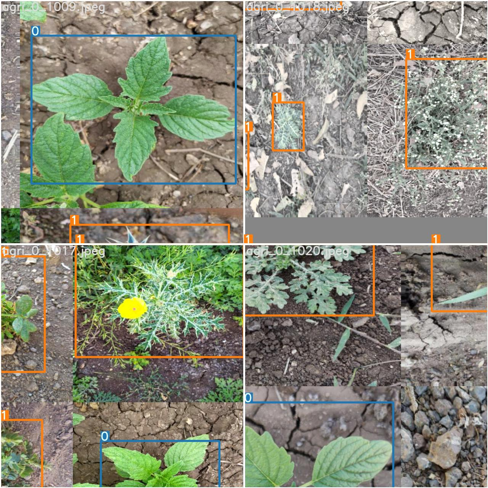
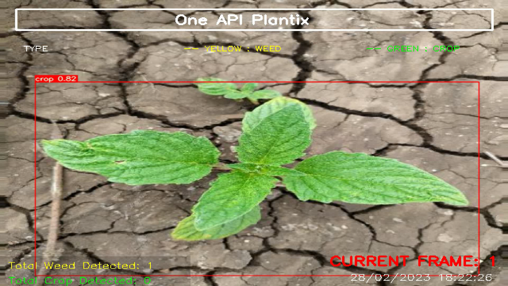
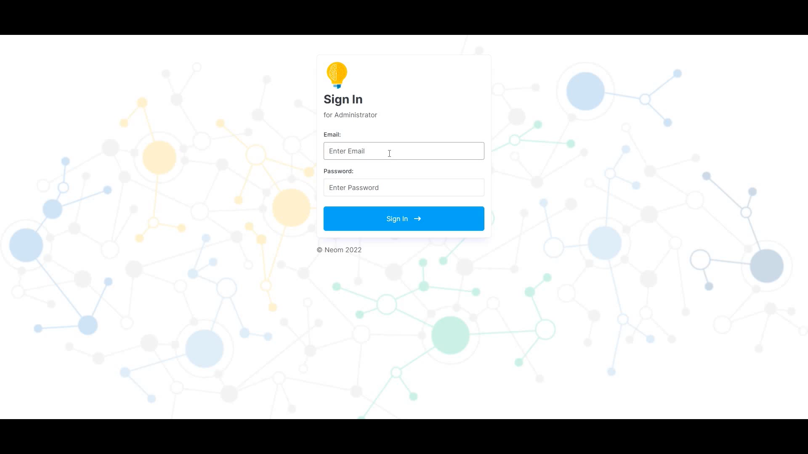
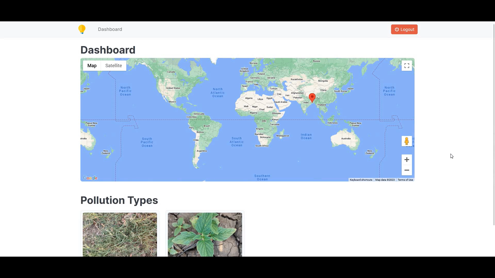
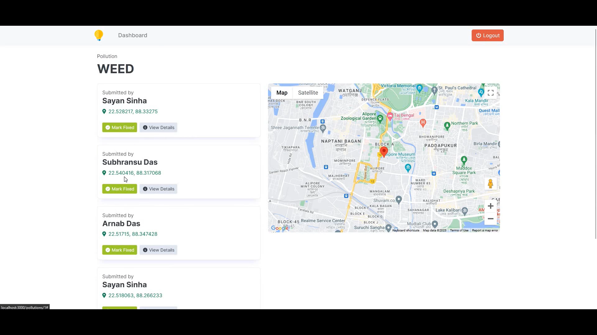
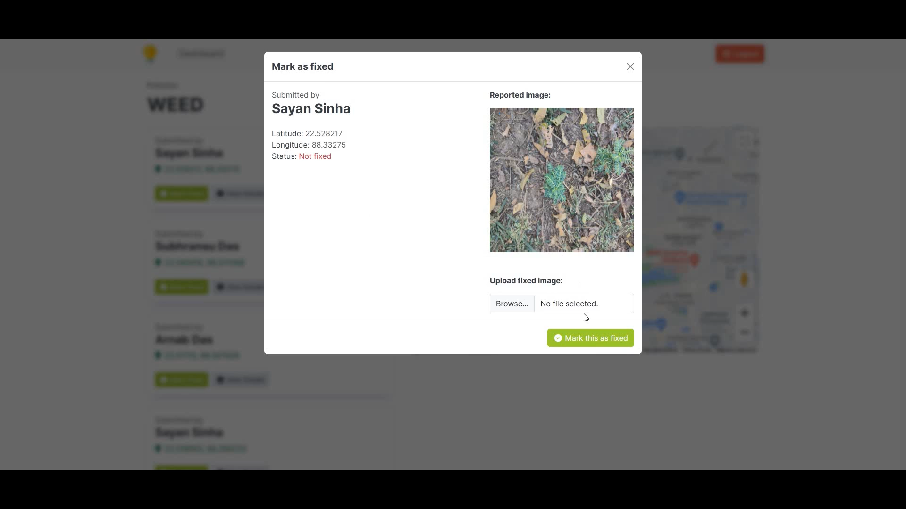
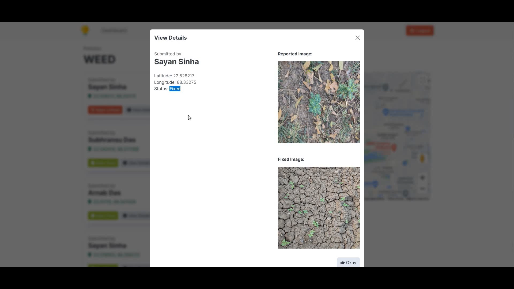

<h1 align="center"><a href="https://www.youtube.com/watch?v=80Ddn2GH7kU">OneAPI Plantix</h1>

## Features
-  Mobile/Desktop Application, to upload visual pollution images after detection from, the yolov7 model.
-  We have used Tiny Yolov7 Model Architecture to ensure, the app requires significantly less, hardware configuration to run the application.
-  Categories/label the images and detect crop/weed. 
-  Custom Labelling tool, to self Label the Application.
-  Sending data points once connected to the internet, like userid, detected_image, label, bounding_box_co-ordinate, latitude, and longitude through rest API.
-  Rest API saves the real-time data, in the database, and sends the data to Admin Web Interface.
-  Admin can then ask the view the weed in the farmland and ask for remedies from hand plucking to spray of Weedicides.
-  Once remedy has been taken. admin can remove the data -points.
-  Auto Train the custom-yolov7 model, with new data points every week, and update the Application AI Model over the internet, to improve the model's accuracy over time.
-  To, incentivize the user to label or find more areas that need a fix, we incentivize them by sending them crypto rewards, through a smart contract, based on the images they are uploading.


## 1. Project Architecture

<p align="center">
  
</p>


## 2. Intel One API Traning Metrics For Object Detection

#### Metrics 

<br />
<p align="center">
  
  
  
  
  
  
  
</p>
<br />

#### Train Batch 

<br />
<p align="center">
  
  
  
  
  
  
  
  
  
  
</p>
<br />

#### Test Batch/ Results 

<br />
<p align="center">
  
  
  
  
  
  
</p>
<br />


## 2. Train the YoloV7 Object Detection Model

### Open Image Labelling Tool

```commandline
labelImg
```

### Add more data from the already labelled images

```
git clone https://github.com/IntelegixLabs/OneAPI_Plantix
cd OneAPI_Plantix/dataset
Add train,val, and test data to Neom/yolov7-custom/data files 
```

### Train the custom Yolov7 Model

```commandline
git clone https://github.com/IntelegixLabs/OneAPI_Plantix
cd OneAPI_Plantix
pip install -r requirements.txt
pip install -r requirements_gpu.txt
pip3 install torch torchvision torchaudio --extra-index-url https://download.pytorch.org/whl/cu117
python train.py --workers 1 --device 0 --batch-size 8 --epochs 100 --img 640 640 --data data/custom_data.yaml --hyp data/hyp.scratch.custom.yaml --cfg cfg/training/yolov7-custom.yaml --name yolov7-custom --weights yolov7.pt

```


## 3. Getting Started With The Application

- Clone the repo and cd into the directory
```sh
$ git clone https://github.com/IntelegixLabs/OneAPI_Plantix.git
$ cd OneAPI_Plantix
$ cd OneAPI_Plantix
```
- Download the Trained Models and Test_Video Folder from google Drive link given below and extract it inside OneAPI_Plantix Folder
- https://drive.google.com/uc?id=1qmlMFar5DF72TgUlrfmc1z9qVBbBq-Gi&export=download

```sh
$ wget https://drive.google.com/uc?id=1qmlMFar5DF72TgUlrfmc1z9qVBbBq-Gi&export=download
```

- Install Python 3.10 and its required Packages like PyTorch etc.

```sh
$ pip install -r requirements.txt
$ pip intsall -r requirements_gpu.txt
$ pip3 install torch torchvision torchaudio --extra-index-url https://download.pytorch.org/whl/cu117
```

- Run the app

```sh
$ python home.py
```


### Packaging the Application for Creating a Execulatle exe File that can run in Windows,Linus,or Mac OS

You can pass any valid `pyinstaller` flag in the following command to further customize the way your app is built.
for reference read the pyinstaller documentation <a href="https://pyinstaller.readthedocs.io/en/stable/usage.html">here.</a>

```sh
$ pyinstaller -i "favicon.ico" --onefile -w --hiddenimport=EasyTkinter --hiddenimport=Pillow  --hiddenimport=opencv-python --hiddenimport=requests--hiddenimport=Configparser --hiddenimport=PyAutoGUI --hiddenimport=numpy --hiddenimport=pandas --hiddenimport=urllib3 --hiddenimport=tensorflow --hiddenimport=scikit-learn --hiddenimport=wget --hiddenimport=pygame --hiddenimport=dlib --hiddenimport=imutils --hiddenimport=deepface --hiddenimport=keras --hiddenimport=cvlib --name Neom home.py
```


### 4. Application Screenshots

<br />
<p align="center">
  
  
  
  
  
  
  
  
</p>
<br />
