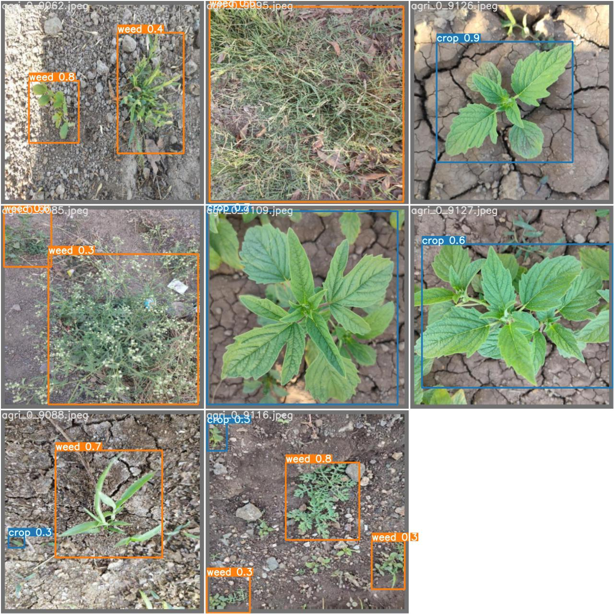
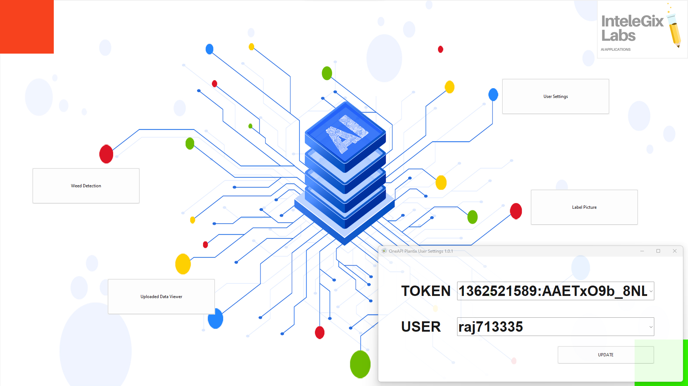

# OneAPI Plantix

## 1. Project Architecture

  

## 2. Intel One API Traning Metrics For Object Detection

#### Metrics 

 

  
  
  
  
  
  
  

bad
 

#### Train Batch 

 

  
  
  
  
  
  
  
  
  
  

 

#### Test Batch/ Results 

 

  
  
  
  
  
  

 

### 3. Application Screenshots

 

  
  

 
